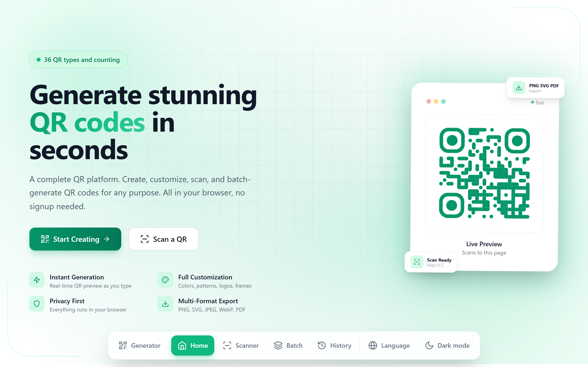
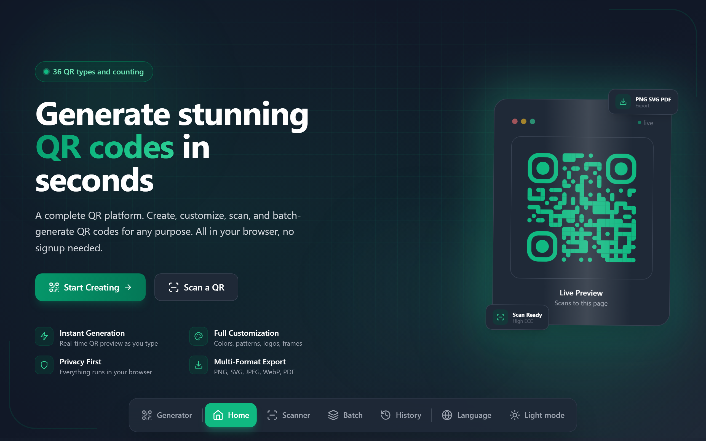
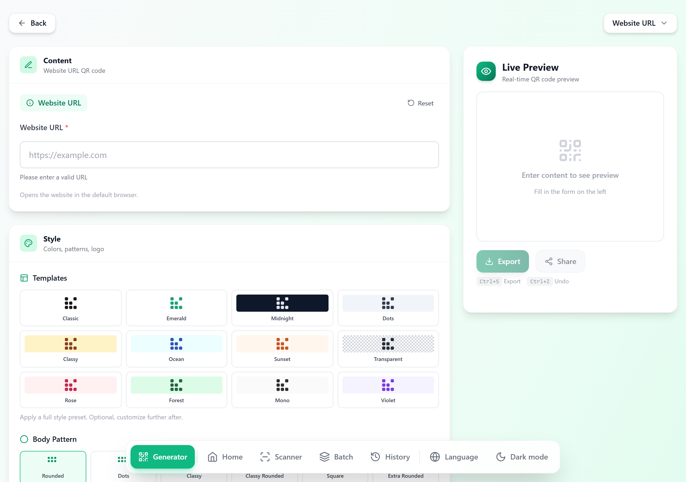
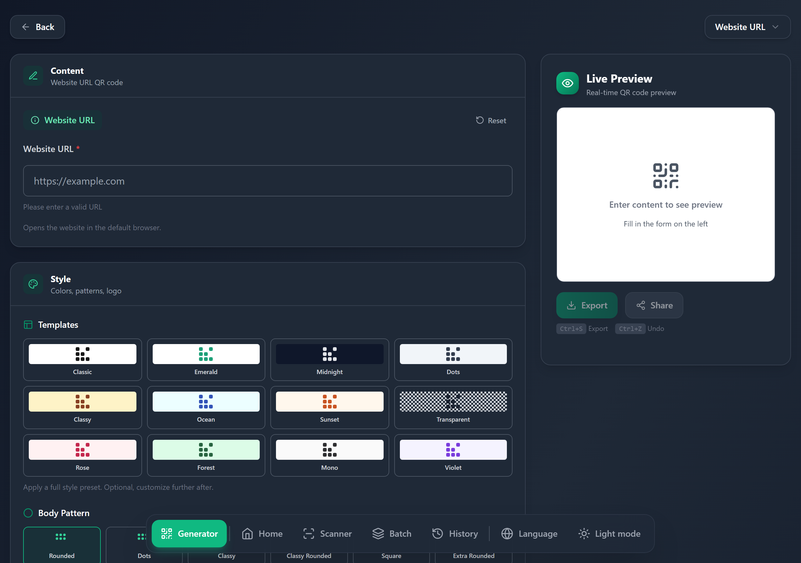
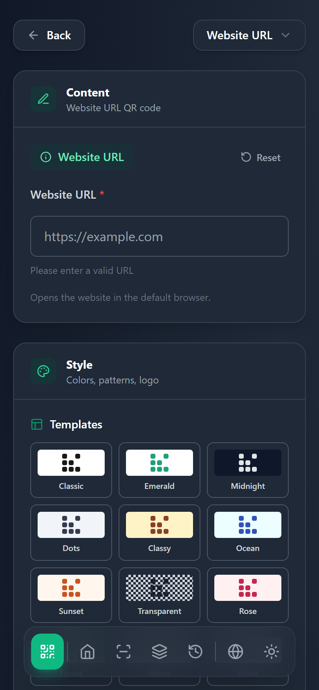

# QR Magic — QR Code Generator

A full-featured, client-side QR code generator. Pick a QR type, fill in the content, customize the appearance, then preview, download, copy, or share via a link. Works offline as an installable PWA.

Live: https://qr-magic.vercel.app/

## Screenshots

### Landing Page (Light)


### Landing Page (Dark)


### Generator (Light)


### Generator (Dark)


### Generator (Mobile)


## Features

### 36 QR types across 13 categories

- **Basic:** Text, Website URL, Custom data
- **Contact & Communication:** Email, Phone, SMS, Contact (vCard), Business Card
- **Social Media:** WhatsApp, Telegram, Messenger, Discord, Instagram, Twitter/X, TikTok, YouTube, LinkedIn, Facebook, Snapchat
- **Communication:** Skype, Zoom
- **Entertainment:** Spotify
- **Connectivity:** Wi-Fi (WPA/WPA2, WEP, open, hidden networks)
- **Location & Events:** Geographic coordinates (geo:), Calendar events (vEvent)
- **Payment:** PayPal, Venmo
- **Cryptocurrency:** Bitcoin, Ethereum
- **Apps & Stores:** App Store, Google Play Store
- **Business & Marketing:** Rating, Review, Coupon, Restaurant Menu
- **Documents:** PDF link

### Customization

- **Style templates:** 12 pre-designed presets (Classic, Emerald, Midnight, Dots, Classy, Ocean, Sunset, Transparent, Rose, Forest, Mono, Violet) — apply a full look in one click, then tweak further
- Foreground and background color pickers, with transparent background option
- Dot pattern (rounded, dots, classy, classy-rounded, square, extra-rounded)
- Corner square and corner dot styles
- Error correction level (L / M / Q / H)
- Margin control
- **Drag-and-drop logo upload** (PNG/JPG/SVG) with adjustable logo size
- Color presets
- Live preview that updates as you type

### Export & share

- **Unified export dialog** with 2-column layout: pick format and size, then Copy or Download side by side
- Download as PNG, SVG, JPEG, WebP, or PDF at multiple sizes (128px to 4096px, plus custom)
- Copy QR image to clipboard (PNG/SVG/JPEG/WebP)
- Transparent background support for PNG, SVG, WebP, and PDF
- Native Web Share API for mobile sharing
- Shareable URL: QR content is encoded into the URL hash so the same QR can be reopened anywhere
- Social share shortcuts (Facebook, Twitter, LinkedIn, WhatsApp, Telegram, email)
- Dedicated `/shared` view for a clean, scan-friendly display of a shared QR (with fullscreen and theme toggle)

### UX

- **Floating pill navigation** docked at the bottom of the screen — icon-only on mobile, icons + labels on desktop, with hover tooltips
- **Generator dropdown** in the nav with 12 quick-pick QR types (icons + names in a multi-column grid)
- Light / dark theme with system preference detection, persisted to localStorage
- Searchable, category-filtered landing page for picking a QR type
- Bilingual UI: English and Khmer (ខ្មែរ)
- Form validation with inline error messages per QR type
- Toast notifications for actions (save, copy, share, errors)
- **Keyboard shortcuts:** `Ctrl+S` to export, `Ctrl+Z` to undo style changes (up to 50 steps)
- Responsive layout (mobile through desktop)
- Installable PWA with offline support via service worker

## Tech stack

- React 18 + TypeScript
- Vite 4 (build tooling, dev server)
- Tailwind CSS 3
- `qr-code-styling` for QR rendering and styling
- `html-to-image` for PNG/JPEG/WebP/SVG export (lazy-loaded)
- `jspdf` for PDF export
- `lucide-react` for icons
- `vite-plugin-pwa` for service worker and manifest

## Getting started

```bash
npm install
npm run dev      # start dev server
npm run build    # type-check + production build to dist/
npm run preview  # preview the production build
```

## Project structure

```
src/
  App.tsx                  # Root component, state, hash-based routing
  main.tsx                 # Entry, theme bootstrap
  index.css                # Tailwind + global styles
  components/
    Header.tsx             # Floating pill nav with generator dropdown
    Footer.tsx
    QRForm.tsx             # Dynamic form rendered from qrTypeConfigs
    QRCustomization.tsx    # Templates, colors, dots, corners, logo, ECC
    QRPreview.tsx          # Live QR render + export/share actions + keyboard shortcuts
    QRModals.tsx           # Export modal (download/copy) + Share modal
    ModernUI.tsx           # Shared button primitives
    FormField.tsx          # Single form field renderer
    SocialPreview.tsx      # Social card preview for /qr-preview route
    Toast.tsx
  pages/
    LandingPage.tsx        # QR type picker with search + categories
    QRGeneratorPage.tsx    # Form + customization + preview layout + undo history
    SharedPage.tsx         # Minimal scan-friendly shared QR view
    ScannerPage.tsx        # QR scanner
    BatchPage.tsx          # Batch QR generation
    HistoryPage.tsx        # Saved QR history
  utils/
    qrGenerators.ts        # Per-type QR string generators + validation
    qrTypes.ts             # Form field configs for every QR type
    qrTemplates.ts         # 12 pre-designed style templates
    colorPresets.ts        # Color preset definitions
    frameTemplates.ts      # Visual frame templates
    scannability.ts        # QR scannability score calculation
    history.ts             # QR history persistence
    urlHash.ts             # Encode/decode QR data to/from URL hash
    export.ts              # PNG/SVG/JPEG/WebP/PDF export, clipboard, Web Share
    i18n.ts                # Translation helpers
  i18n/
    translations.ts        # English + Khmer strings
  types/
    index.ts               # QRData union, options, form field types
public/
  screenshots/             # App screenshots for README
  manifest.json            # PWA manifest
  qr-icon.svg, logo/       # Icons and OG banner
```

## How sharing works

QR content is serialized into the URL hash (e.g. `#qr-type=wifi&ssid=...&password=...`). Opening that URL rehydrates the QR on any device. The `/shared` path renders a minimal scan-friendly view; the `/qr-preview` path renders a social card preview.

## License

None specified.
